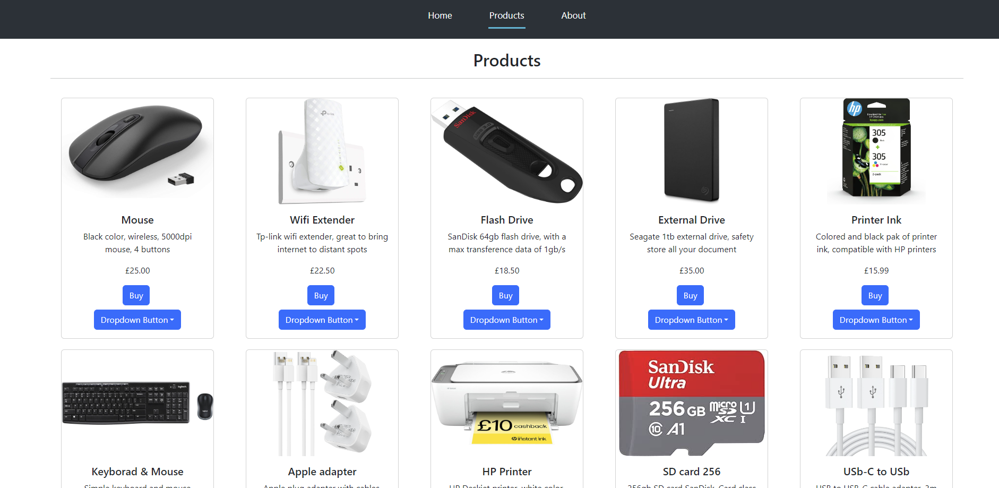

<h3 align="center">
    <b>Web Store App - Task 20</b> 
</h3>

## :computer: Web

<h1 align="center">
    
</h1>

## :bookmark: About

A online store app made with REACT to understand the ROUTER component.

## :rocket: Tech Used

This project was made with the following technologies:

- [ReactJs](https://react.dev/)
- [Bootstrap](https://react-bootstrap.netlify.app/)
<!-- - [Javascript](https://developer.mozilla.org/en-US/docs/Web/JavaScript) -->
<!-- - [HTML](https://developer.mozilla.org/en-US/docs/Web/HTML)
- [CSS](https://developer.mozilla.org/en-US/docs/Web/CSS) -->

## :fire: How to

- ### **Requirements**

  - It's **necessary** **[Node.js](https://nodejs.org/en/)**

1. Clone the repo and move the the right directory :

```sh
  > git clone https://github.com/Cancellier27/codingTasks
  > cd my-store-app
```

2. Install dependencies:

```sh
  > npm install
```

3. Execute the app:

```sh
  > npm start
```

4. How to use

```sh
To use the website please login with any username and password in the home page to unlock the remaining pages.
```


## :mailbox_with_mail: Get in touch!

<a href="https://filipe-site.now.sh/" target="_blank" >
  
</a>&nbsp;&nbsp;&nbsp;
<a href="https://www.linkedin.com/in/filipe-cancellier-da-costa-8459ab160/" target="_blank" >
  
</a>&nbsp;&nbsp;&nbsp;
<a href="mailto:filipecancelliercosta@gmail.com" target="_blank" >
  
</a>

##
<p align="center">
  <a href="https://www.linkedin.com/in/filipe-cancellier-da-costa-8459ab160/">
    
  </a>
</p>